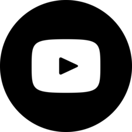

<!-- PROJECT LOGO -->
<p align="center">
  <a href="https://github.com/mrauer/freetube">
    
  </a>

  <h3 align="center">FreeTube</h3>

  <p align="center">
    Offline viewing of YouTube videos.
    <br />
    <br />
    <a href="https://github.com/mrauer/freetube/issues">Report Bug</a>
    ·
    <a href="https://github.com/mrauer/freetube/issues">Request Feature</a>
  </p>
</p>

<!-- TABLE OF CONTENTS -->
<summary><h2 style="display: inline-block">Table of Contents</h2></summary>
  <ol>
    <li><a href="#commands">Commands</a></li>
    <li><a href="#license">License</a></li>
  </ol>

<!-- COMMANDS -->
## Commands

Once you start the software for the first time you will be asked to authorize your device.

If you are in the dev environment (TOKEN_FROM_PROMPT set to 1), then you will be asked to visit a web page and get token from there:

```sh
./freetube


https://accounts.google.com/o/oauth2/auth?access_type=offline&clie...

4/0AX4XfWg9TyeoxQ1yvMyE09yA14OM2pXv-CfKOj11h9vsp79YaFaFOotrDSoWxxxxxxxxxx 
(this is what the token should look like)
```

In case you've downloaded the software, a web page will open and you just need to follow the flow. This will only be asked you once until the token expire.

There might be some conflicts. Make sure that `.credentials/youtube-go.json` is removed before you proceed.


From now on your device is authorized and we can proceed with the next step.

The regular command with no arguments should now return the list of channels you've subscribed for.

```sh
./freetube


0 : IHU Méditerranée-Infection (UCFaPzuoXcACu7jplePDfXmA)
1 : Sud Radio (UCESTwDXpoMgiYBHipMdKTkQ)
2 : Marianne (UC4V5osIDMjFwtCRxMm2e0LA)
...
```

You can choose a channel from which all videos will be downloaded as `.mp4`. Any that you would have already downloaded will not be re-downloaded.

```sh
Choose from the above subscriptions which one to download all videos from: 35

Downloading Complot Vieux - Made In Groland
Downloading La prevention ivresse - Groland Le Zapoi du 28/04 - CANAL+
```

<!-- LICENSE -->
## License

Distributed under the MIT License. See `LICENSE` for more information.
